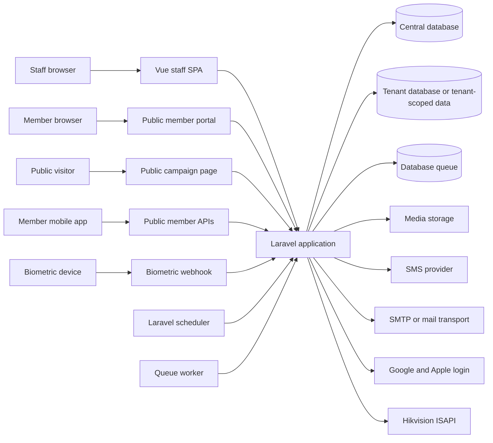
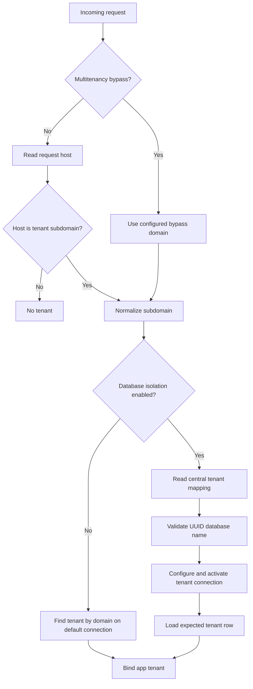

# System Architecture

Last reviewed: 2026-07-05

## Purpose

This document describes how the application is structured at the system level. It is intended for engineers and AI assistants before designing larger changes.

For business-only context, read `docs/business-overview.md`. For endpoints, services, data model, commands, jobs, and ER details, read `docs/technical-reference.md`.

## Documentation Maintenance Rule

After every architecture, deployment, tenancy, integration, queue, scheduler, auth, or cross-module flow change, update this document or explicitly state why it does not need an update. If the same change also alters business behavior or data structures, update the business and technical documents too.

## System Summary

The application is a Laravel 12 multi-tenant SaaS platform for fitness businesses. It combines:

- A Laravel backend with session-authenticated web and API routes.
- A Vue 3 SPA for staff operations.
- A public member portal served as a separate frontend entry.
- Public campaign registration pages served as a separate frontend entry.
- A React Native Expo member mobile app that uses the public member portal APIs.
- MySQL-compatible central and tenant database connections.
- Database-backed sessions, cache, queues, and scheduled tasks.
- External integrations for SMS, email, media storage, social login, and Hikvision biometric devices.

Current local environment reported by Laravel:

| Area | Current value |
| --- | --- |
| Laravel | 12.53.0 |
| PHP | 8.3.24 |
| Application environment | local |
| Application URL | localhost:8001 |
| Application timezone | UTC |

## High-Level Context

## Main Runtime Components

| Component | Responsibility | Main locations |
| --- | --- | --- |
| Laravel app | HTTP routing, middleware, auth, controllers, services, jobs, commands, models. | `app/`, `routes/`, `config/` |
| Staff SPA | Authenticated operational UI with hash-based routing. | `resources/js/spa/` |
| Public member portal | Browser-based member OTP experience. | `resources/js/public-profile.js`, `resources/js/spa/components/PublicProfileApp/` |
| Public campaign registration | Browser-based public member registration forms for published campaigns. | `resources/js/public-campaign.js`, `resources/js/spa/pages/PublicCampaignPage.vue` |
| Member mobile app | React Native app for OTP login and member profile views. | `members_mobileapp/` |
| Service layer | Business logic and transaction orchestration. | `app/Services/` |
| Models | Eloquent entities and relationships. | `app/Models/` |
| Tenant middleware | Activates tenant context and database connection. | `InitializeTenantConnection`, `IdentifyTenant`, `TenantDatabaseManager` |
| Queues and jobs | Background delivery, reports, forms, biometric import/sync, legacy command wrappers. | `app/Jobs/` |
| Scheduler | Automated member notification commands. | `routes/console.php` |
| Media storage | Tenant/environment-prefixed file storage and URLs. | `MediaStorageService`, `config/filesystems.php` |
| Legacy imports | Manual sync tools for members, attendance, and payments. | `app/Console/Commands/import_data_from_nanosoft/` |

## Technology Stack

| Layer | Technology |
| --- | --- |
| Backend | Laravel 12, PHP 8.2+ |
| Auth | Laravel session guard, Socialite for Google and Apple |
| Backend tests | PHPUnit |
| Frontend | Vue 3, Vue Router hash history, Axios, Tailwind CSS 4, Lucide icons |
| Frontend tests | Vitest, Vue Test Utils, jsdom |
| Mobile | Expo, React Native, TypeScript |
| PDF generation | DomPDF and mPDF packages |
| Storage | Laravel filesystem, local public disk or S3-compatible storage such as R2 |
| Queues | Laravel database queue |
| Database | MySQL-compatible runtime, SQLite-friendly tests where supported |
| Biometric | Hikvision ISAPI over HTTP Digest Auth |

## Request Lifecycle

### Staff Web and API Requests

1. `InitializeTenantConnection` runs early in the web middleware stack.
2. The tenant domain is resolved from the request host or development bypass domain.
3. If tenant database isolation is enabled, the runtime tenant database connection is activated before session hydration.
4. `IdentifyTenant` ensures routes that require a tenant have one.
5. Laravel session auth identifies the staff user.
6. Permission middleware checks route-level permissions.
7. Controllers delegate business work to services.
8. Services use Eloquent models, transactions, audit logging, notifications, queues, integrations, and media storage as required.
9. API controllers return JSON to the Vue SPA.

### Public Member Portal Requests

1. The tenant is resolved from the domain.
2. Public OTP routes allow a member to request and verify a one-time password.
3. Verified members receive a short-lived public profile token.
4. `ResolvePpToken` resolves member-facing requests from the `X-PP-Token` header.
5. Member portal routes return only the verified member's own profile, wallet, event, workout, and notification data.

### Public Campaign Registration Requests

1. The tenant is resolved from the domain.
2. `/campaigns/{slug}` serves a lightweight public Vue entry.
3. Public campaign APIs expose only published campaign form configuration and tenant branding.
4. Public submissions are validated against the server-side campaign field catalog and document requirements.
5. Accepted submissions create unverified members linked to the campaign and store uploaded documents through tenant media storage.

### Biometric Webhook Requests

1. The device posts to `/api/biometric/events/{tenantDomain}` outside normal session and CSRF handling.
2. The tenant is resolved from the URL domain and authenticated by tenant webhook token.
3. The webhook records the access event and may queue follow-up processing.
4. Successful member authentication can create attendance.

### Background Work

1. Jobs receive tenant and entity identifiers rather than trusting ambient request state.
2. Jobs activate or bind the tenant before tenant-owned model work.
3. Delivery failures are generally logged and must not corrupt core business records.
4. Scheduled notification commands iterate tenants when database isolation is enabled.

## Tenancy Architecture

The app supports two tenancy modes:

| Mode | Behavior |
| --- | --- |
| Non-isolated mode | Tenant records and tenant-owned data live in one database. Tenant context is resolved by domain and data is scoped by tenant ownership. |
| Database-isolated mode | A central database stores tenant mappings and central infrastructure. Each tenant can be activated through a runtime `tenant` database connection. |

Important tenancy files:

- `config/tenancy.php`
- `config/database.php`
- `app/Services/Tenancy/TenantDatabaseManager.php`
- `app/Http/Middleware/InitializeTenantConnection.php`
- `app/Http/Middleware/IdentifyTenant.php`
- `app/Console/Commands/MigrateTenantDatabases.php`
- `app/Console/Commands/PrepareCentralDatabase.php`
- `app/Console/Commands/SplitTenantDatabasesOnceCommand.php`

### Tenant Resolution

### Central Versus Tenant Data

In database-isolated mode, central infrastructure is intentionally minimal. Central stores tenant mapping and central runtime infrastructure such as sessions, cache, queues, failed jobs, and migration control data. Tenant-owned business records live in each tenant database.

In non-isolated mode, the app still resolves tenant context and uses tenant-aware business logic.

## Authentication and Authorization

Staff authentication uses Laravel sessions. Login accepts the tenant-scoped staff identity handled by `AuthSessionService` and `AuthApiController`. Social login is supported through Google and Apple callbacks.

Authorization uses roles and permissions:

- Users belong to one role.
- Roles have many permissions through `role_permission`.
- Route middleware enforces permission slugs.
- `AppContextService` exposes a flattened permission map to the SPA.
- The SPA uses the context permissions to show navigation and allowed actions.

## Frontend Architecture

The staff UI is a Vue SPA mounted from the Laravel shell.

Key frontend pieces:

- `resources/js/spa/main.js`: SPA entry.
- `resources/js/spa/router.js`: hash-history routes.
- `resources/js/spa/routeLoader.js`: navigation loading state and permission gate support.
- `resources/js/spa/composables/useApiClient.js`: Axios wrapper with CSRF and auth refresh handling.
- `resources/js/spa/composables/useAppContext.js`: shared app context.
- `resources/js/spa/composables/useNavigation.js`: permission-aware navigation.
- `resources/js/spa/pages/`: route-level pages.
- `resources/js/spa/components/`: shared components.

The public member portal is a separate member-facing experience and is intentionally smaller than the staff SPA.

Public campaign registration is also a separate public entry. Staff manage campaigns inside the authenticated SPA under Settings, while visitors use `/campaigns/{slug}` without staff login.

The mobile app in `members_mobileapp/` uses the same public OTP and member profile APIs as the public member portal.

## Service Layer Architecture

Controllers should remain thin. Domain services own business rules, transactions, serialization, audit calls, notification dispatch, and integration orchestration.

Common patterns:

- Services receive `tenantId`, `Tenant`, `User`, or model instances from controllers.
- Services validate tenant ownership before mutating related records.
- Public-facing services re-derive allowed fields and constants server-side rather than trusting form configuration from the browser.
- Financial workflows centralize transaction and settlement side effects.
- Device and notification services catch integration failures where business continuity matters.
- Media storage is accessed through `MediaStorageService`, not direct storage calls.

## Financial Architecture

Financial records are distributed across payments, sales, wallet top-ups, vouchers, expenses, transfers, payment settlements, and company account transactions.

Architecture rules:

- Payments and paid sales can create settlements and account transactions.
- Wallet top-ups and voucher redemptions affect member wallet balance.
- Expenses and transfers affect company account activity.
- Reconciliation compares recorded expectations with actual counted values.
- Financial mutations should happen inside service-managed workflows and database transactions where possible.

## Integration Architecture

| Integration | Architectural role |
| --- | --- |
| SMS | Sent through `SmsService`; used for OTP and notifications. |
| Email | Sent through tenant-aware mail services and queued jobs. |
| Social login | Handled through Socialite controllers. |
| Media storage | Tenant and environment namespacing through `MediaStorageService`. |
| Hikvision devices | Low-level ISAPI in `HikvisionService`; orchestration in `BiometricSyncService`. |
| Legacy provider | Manual commands sync members, attendance, and payments from legacy gym APIs. |

## Queue and Scheduler Architecture

Jobs:

- `SendBulkNotificationJob`
- `SendMemberNotificationJob`
- `SendFormSubmissionEmailJob`
- `SendDailySummaryReportJob`
- `SendRealProfitReportJob`
- `SyncBiometricMemberJob`
- `ProcessBiometricAccessEventJob`
- `ImportBiometricAccessEventsJob`
- `RunLegacyCommand`

Scheduled commands:

- `notifications:membership-expiry` runs daily at 01:00 UTC.
- `notifications:member-milestones` runs daily at 01:00 UTC.

Operational tenant commands:

- `tenants:prepare-central`
- `tenants:split-once`
- `tenants:migrate`

Legacy commands:

- `legacy:sync-members`
- `legacy:sync-attendance`
- `legacy:sync-payments`
- `legacy:delete-member-users`

## Deployment and Configuration Notes

Important configuration areas:

- `APP_MULTITENANCY_ENABLED`
- `APP_MULTITENANCY_BYPASS_DOMAIN`
- `APP_DOMAIN`
- `TENANT_DATABASE_ISOLATION_ENABLED`
- `CENTRAL_DB_*`
- `TENANT_DB_CONNECTION`
- `TENANT_BLANK_DATABASE`
- `CACHE_STORE`
- `QUEUE_CONNECTION`
- `SESSION_DRIVER`
- `DB_CACHE_CONNECTION`
- `DB_QUEUE_CONNECTION`
- `SESSION_CONNECTION`
- SMS provider credentials
- Mail credentials
- Media disk and S3-compatible storage credentials
- Social login credentials

When database isolation is enabled, host-only session cookies are required. Do not configure a shared session domain for isolated tenants.

## Architecture Change Checklist

Before implementing a significant change, confirm:

- Does it run before or after tenant resolution?
- Does it need central data, tenant data, or both?
- Does it run in HTTP, queue, scheduler, command, webhook, or mobile/public context?
- Does a public route expose only tenant-approved data?
- Does it need a new permission or app context flag?
- Does it create financial, inventory, attendance, notification, or audit side effects?
- Does it need media namespacing?
- Does it need tenant activation in a job or command?
- Does it require updates to `docs/business-overview.md` or `docs/technical-reference.md`?
