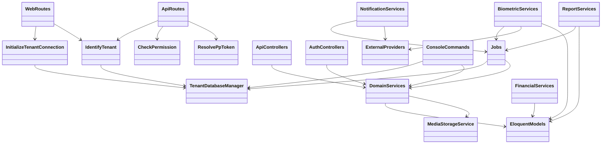

# Technical Reference

Last reviewed: 2026-07-04

## Purpose

This document is the technical reference for engineers and AI assistants. It covers implementation structure, routes, permissions, services, jobs, commands, data model, and ER diagrams.

Read `docs/business-overview.md` first for product intent and `docs/system-architecture.md` for system-level design.

## Documentation Maintenance Rule

After every code change, the AI assistant must check this document for required updates. Update it when the change affects:

- Data model, migrations, Eloquent relationships, or table ownership.
- Routes, controllers, services, jobs, commands, scheduler behavior, or middleware.
- Permissions, app context flags, role behavior, or navigation visibility.
- Tenancy, database isolation, media paths, queue behavior, or integration flow.
- Financial, inventory, biometric, notification, reporting, form, member portal, or mobile behavior.

If a change also affects business process or architecture, update `docs/business-overview.md` and `docs/system-architecture.md` in the same session.

## Repository Map

| Path | Purpose |
| --- | --- |
| `app/Http/Controllers/Api/` | JSON API controllers. |
| `app/Http/Controllers/Auth/` | Web login, registration, reset password, and social auth controllers. |
| `app/Http/Middleware/` | Tenant resolution, permission, active-user, and public-profile-token middleware. |
| `app/Models/` | Eloquent models and relationships. |
| `app/Services/` | Domain services and integration orchestration. |
| `app/Jobs/` | Queue jobs. |
| `app/Console/Commands/` | Tenant operations and legacy import commands. |
| `routes/api.php` and `routes/api/*.php` | API route registration. |
| `routes/web.php` | Root, auth, SPA shell, member portal, and legacy Blade routes. |
| `routes/console.php` | Scheduled commands and small console closures. |
| `resources/js/spa/` | Vue staff SPA. |
| `resources/js/spa/components/PublicProfileApp/` | Member-facing portal components. |
| `members_mobileapp/` | Expo React Native member app. |
| `database/migrations/tenant/` | Tenant and application schema migrations. |
| `database/seeders/` | Tenant, role, permission, workout, voucher, and form seeders. |
| `tests/Feature/` | Backend feature tests. |
| `resources/js/__tests__/` | Frontend tests. |

## Runtime and Tooling

| Area | Command |
| --- | --- |
| Full dev stack | `composer dev` |
| Backend tests | `composer test` |
| Backend lint check | `composer lint` |
| Backend lint fix | `composer lint:fix` |
| Frontend dev server | `npm run dev` |
| Frontend build | `npm run build` |
| Frontend tests | `npm test` |
| Frontend lint | `npm run lint` |
| Mobile app start | `cd members_mobileapp && npm run start` |
| Mobile app typecheck | `cd members_mobileapp && npm run typecheck` |

`php artisan route:list --except-vendor` currently reports 314 non-vendor routes.

## Core Stack

| Concern | Implementation |
| --- | --- |
| Backend framework | Laravel 12 |
| Runtime language | PHP 8.2+ |
| Frontend | Vue 3, Vue Router hash history, Axios, Tailwind CSS 4 |
| Mobile | Expo, React Native, TypeScript |
| Auth | Laravel session guard, Socialite for Google and Apple |
| Authorization | Role and permission models plus `permission` middleware |
| Queue | Laravel database queue |
| Scheduler | Laravel scheduler in `routes/console.php` |
| Database connections | `mysql`, `central`, `tenant`, plus framework alternatives |
| Media | Laravel filesystem through `MediaStorageService` |
| PDF | DomPDF and mPDF |
| Biometric | Hikvision ISAPI through `HikvisionService` |

## Middleware and Request Boundaries

| Middleware | Responsibility |
| --- | --- |
| `InitializeTenantConnection` | Runs before session hydration, deactivates previous tenant state, resolves tenant domain, activates tenant database when needed. |
| `IdentifyTenant` | Ensures tenant-required routes have a bound tenant. Redirects to root when no tenant is available. |
| `CheckPermission` | Enforces comma-separated permission slugs with OR behavior. |
| `ResolvePpToken` | Resolves public member portal token from `X-PP-Token`. |
| `EnsureActiveUser` | Ensures inactive users cannot continue using the app. |

CSRF exclusions currently include public member OTP/activity/event registration routes. The biometric webhook lives outside normal session and CSRF handling.

## Tenancy Technical Notes

Important files:

- `config/tenancy.php`
- `config/database.php`
- `app/Services/Tenancy/TenantDatabaseManager.php`
- `app/Http/Middleware/InitializeTenantConnection.php`
- `app/Http/Middleware/IdentifyTenant.php`

Tenant activation rules:

1. Resolve a normalized tenant domain from the request host or bypass domain.
2. In non-isolated mode, load `Tenant` by `domain`.
3. In database-isolated mode, read central mapping from `tenants.subdomain` and `tenants.database_name`.
4. Validate tenant database names as UUIDs before configuring the runtime tenant connection.
5. Set Laravel's default connection to the activated tenant connection.
6. Bind the resolved `Tenant` model as `app('tenant')`.

Operational constraints:

- Never accept a database name from request input.
- When isolation is enabled, session cookies must be host-only.
- Jobs and commands that touch tenant-owned data must activate or bind the tenant first.
- Media paths are prefixed by environment and tenant UUID.

## Authentication

Staff auth:

- API login: `POST /api/auth/login`
- API logout: `POST /api/auth/logout`
- API refresh: `POST /api/auth/refresh`
- Web login, registration, password reset, and social auth are in `routes/web.php`.
- `AuthSessionService` owns login, logout, and session refresh behavior.

Public member auth:

- `POST /api/public/request-otp`
- `POST /api/public/verify-otp`
- Subsequent member portal requests use `X-PP-Token`.
- The mobile app uses the same public OTP flow.

## Permission Model

Data model:

- `users.role_id -> roles.id`
- `roles <-> permissions` through `role_permission`
- `User::hasPermission()` delegates to the user's role.
- Permissions are seeded from `App\Support\SidebarPermissionCatalog`.
- `AppContextService` maps permission slugs into frontend booleans.

Permission groups:

| Group | Permission slugs |
| --- | --- |
| Dashboard | `dashboard.view` |
| Members | `members.view`, `members.temp.view`, `members.create`, `members.edit`, `members.delete` |
| Inventory | `inventory.manage`, `inventory.stock`, `inventory.display`, `inventory.audit` |
| Accounting | `payments.manage`, `expenses.manage`, `accounts.transfers`, `accounts.transactions` |
| Sales | `sales.process`, `sales.paid.view`, `sales.create`, `sales.edit`, `sales.delete` |
| Employees | `employees.manage`, `employee_pay_sheets.manage` |
| Reports | `reports.daily_summary`, `reports.real_profit`, `reports.view`, `reports.customers`, `reports.products` |
| Settings | `settings.manage`, `settings.configuration`, `settings.biometric`, `settings.legacy_tools` |
| Users and roles | `users.view`, `users.create`, `users.edit`, `users.delete`, `roles.view`, `roles.permissions` |
| Settings submodules | `accounts.manage`, `payment_plans.manage`, `payment_methods.manage`, `notifications.send`, `events.manage`, `vouchers.manage`, `forms.manage` |
| Workout | `workouts.manage`, `workouts.exercises`, `workouts.assignments` |
| Activity | `activity.view` |
| Reconciliation | `reconciliation.perform`, `reconciliation.manage` |
| Member portal | `member.workout.view`, `member.payments.view` |

## API Route Inventory

Route source of truth is `routes/api.php` and the files under `routes/api/`.

| Area | Route prefixes | Controller focus |
| --- | --- | --- |
| Health | `/api/health` | Health check |
| Auth | `/api/auth/*` | Session login, logout, refresh |
| Context | `/api/app/context` | User, tenant, settings, permission map |
| Dashboard | `/api/dashboard/*` | Overview and stats |
| Users | `/api/users/*` | Staff users |
| Roles | `/api/roles/*` | Roles and role permissions |
| Members | `/api/members/*` | Members, temp members, avatar, attendance, related views |
| Member documents | `/api/members/{member}/documents/*` | Member file documents |
| Body measurements | `/api/members/{member}/body-measurements/*` | Member measurements |
| Wallet | `/api/wallet/*`, `/api/members/{member}/wallet/*`, `/api/wallet-topups/*` | Wallet top-up and transactions |
| Vouchers | `/api/vouchers/*`, `/api/members/{member}/wallet/redeem-voucher` | Voucher management and redemption |
| Payments | `/api/payments/*` | Member payments |
| Payment plans | `/api/payment-plans/*` | Plan management |
| Payment methods | `/api/payment-methods/*` | Method and settlement configuration |
| Accounts | `/api/accounts/*` | Company accounts, transfers, transactions, expenses, settlements |
| Inventory | `/api/inventory/*` | Products, variations, stock, display, audit |
| Sales | `/api/sales/*` | Sales, paid/outstanding views, mark paid |
| Employees | `/api/employees/*`, `/api/employee-pay-sheets/*` | Employee records, attendance, documents, pay sheets |
| Workouts | `/api/exercises/*`, `/api/workout-programs/*`, `/api/workout-program-assignments/*` | Exercise library, programs, assignment |
| Events | `/api/events/*` | Events, registrations, payment, attendance |
| Notifications | `/api/notifications/*` | Bulk notification campaigns |
| Public profile | `/api/public/*` | OTP, profile, wallet, events, notifications |
| Activity | `/api/member-activity/*` | Member activity log and export |
| Reconciliation | `/api/reconciliation/*` | Config, open, close, comparison, history |
| Reports | `/api/reports/*` | Overview, daily summary, real profit, PDFs, email |
| Forms | `/api/forms/*` | Form templates, submissions, member submission |
| Settings | `/api/settings/*` | General settings, configuration, legacy tools, biometric |
| Biometric webhook | `/api/biometric/events/{tenantDomain}` | Device event push |

## Service Catalog

| Domain | Primary services |
| --- | --- |
| Auth and context | `AuthSessionService`, `AppContextService`, `PasswordResetService` |
| Tenant operations | `TenantDatabaseManager`, `TenantConfigurationService`, `TenantLandingPageService`, `TenantMailService`, `MemberPortalUrlService` |
| Users and roles | `UserService`, `RoleService`, `AuditService` |
| Members | `MemberService`, `MemberDocumentService`, `MemberBodyMeasurementService`, `MemberPortalUrlService` |
| Payments and wallets | `PaymentService`, `PaymentPlanService`, `PaymentMethodService`, `PaymentSettlementService`, `WalletService`, `VoucherService` |
| Sales and inventory | `SaleProcessingService`, `SaleMetaService`, `InventoryService` |
| Accounting | `CompanyAccountService`, `ExpenseService`, `ReconciliationService` |
| Employees | `EmployeeService`, `EmployeePaySheetService` |
| Workouts | `WorkoutProgramService` |
| Events and forms | `EventService`, `FormBuilderService` |
| Reports | `DashboardOverviewService`, `DailySummaryService`, `DailySummaryReportService`, `RealProfitReportService` |
| Notifications | `BulkNotificationService`, `AutomatedMemberNotificationService`, `SmsService` |
| Biometric | `BiometricSyncService`, `BiometricQueueStatusService`, `HikvisionService` |
| Media | `MediaStorageService` |

## Application Class and Service Diagram

This diagram shows the main dependency shape. It is intentionally grouped by role so future changes can quickly identify where logic belongs.



## Jobs, Commands, and Schedule

Jobs:

- `SendBulkNotificationJob`
- `SendMemberNotificationJob`
- `SendFormSubmissionEmailJob`
- `SendDailySummaryReportJob`
- `SendRealProfitReportJob`
- `SyncBiometricMemberJob`
- `ProcessBiometricAccessEventJob`
- `ImportBiometricAccessEventsJob`
- `RunLegacyCommand`

Scheduled commands:

| Command | Schedule |
| --- | --- |
| `notifications:membership-expiry` | Daily at 01:00 UTC, one server |
| `notifications:member-milestones` | Daily at 01:00 UTC, one server |

Operational commands:

| Command | Purpose |
| --- | --- |
| `tenants:prepare-central` | Create central session, cache, and queue infrastructure tables. |
| `tenants:split-once` | One-time split from current MySQL database into central registry and UUID tenant databases. |
| `tenants:migrate` | Run migrations for tenant databases and blank onboarding database. |
| `legacy:sync-members` | Sync members and linked users from legacy gym API. |
| `legacy:sync-attendance` | Sync attendance from legacy gym API. |
| `legacy:sync-payments` | Sync payment history from legacy gym API. |
| `legacy:delete-member-users` | Delete member-role users and nullify member links. |

## Data Model Overview

The following ER diagram is a practical domain-level map. It shows the core business relationships and all major model groups. It is not a full column-level migration dump; migrations remain the column source of truth.

```mermaid
erDiagram
    TENANTS ||--o{ USERS : owns
    TENANTS ||--o{ MEMBERS : owns
    TENANTS ||--o{ TENANT_CONFIGURATIONS : configures
    TENANTS ||--o{ COMPANY_ACCOUNTS : owns
    TENANTS ||--o{ PRODUCTS : owns
    TENANTS ||--o{ SALES : owns
    TENANTS ||--o{ MEMBER_PAYMENTS : owns
    TENANTS ||--o{ PAYMENT_PLANS : owns
    TENANTS ||--o{ WORKOUT_PROGRAMS : owns
    TENANTS ||--o{ EXERCISES : owns
    TENANTS ||--o{ EVENTS : owns
    TENANTS ||--o{ BULK_NOTIFICATIONS : owns
    TENANTS ||--o{ FORM_TEMPLATES : owns
    TENANTS ||--o{ EMPLOYEES : owns
    TENANTS ||--o{ RECONCILIATION_SESSIONS : owns
    TENANTS ||--o{ BIOMETRIC_ACCESS_EVENTS : owns
    TENANTS ||--o{ BIOMETRIC_SYNC_LOGS : owns

    ROLES ||--o{ USERS : assigned_to
    ROLES }o--o{ PERMISSIONS : grants
    USERS ||--o| MEMBERS : portal_account
    USERS ||--o{ AUDIT_LOGS : performs

    MEMBERS ||--o{ MEMBER_DOCUMENTS : has
    MEMBERS ||--o{ MEMBER_BODY_MEASUREMENTS : has
    MEMBERS ||--o{ MEMBER_ATTENDANCES : has
    MEMBERS ||--o{ MEMBER_ACTIVITY_LOGS : creates
    MEMBERS ||--o{ MEMBER_NOTIFICATIONS : receives
    MEMBERS ||--o{ MEMBER_PAYMENTS : pays
    MEMBERS ||--o{ WALLET_TOPUPS : receives
    MEMBERS ||--o{ VOUCHER_REDEMPTIONS : redeems
    MEMBERS ||--o{ WORKOUT_PROGRAM_ASSIGNMENTS : assigned
    MEMBERS ||--o{ EVENT_REGISTRATIONS : registers
    MEMBERS ||--o{ FORM_SUBMISSIONS : submits

    PAYMENT_PLANS ||--o{ MEMBERS : default_plan
    PAYMENT_PLANS ||--o{ PAYMENT_MEMBERSHIPS : used_by
    MEMBER_PAYMENTS ||--o| PAYMENT_MEMBERSHIPS : creates_period
    PAYMENT_METHODS ||--o{ MEMBER_PAYMENTS : used_by
    PAYMENT_METHODS ||--o{ SALES : used_by
    PAYMENT_METHODS ||--o{ PAYMENT_SETTLEMENTS : creates
    COMPANY_ACCOUNTS ||--o{ MEMBER_PAYMENTS : receives
    COMPANY_ACCOUNTS ||--o{ SALES : receives
    COMPANY_ACCOUNTS ||--o{ EXPENSES : pays
    COMPANY_ACCOUNTS ||--o{ COMPANY_ACCOUNT_TRANSACTIONS : posts
    COMPANY_ACCOUNTS ||--o{ COMPANY_ACCOUNT_TRANSFERS : source
    COMPANY_ACCOUNTS ||--o{ COMPANY_ACCOUNT_TRANSFERS : destination
    COMPANY_ACCOUNTS ||--o{ PAYMENT_METHODS : settles_to
    MEMBER_PAYMENTS ||--o| PAYMENT_SETTLEMENTS : settlement_source
    SALES ||--o| PAYMENT_SETTLEMENTS : settlement_source

    PRODUCTS ||--o{ PRODUCT_VARIATIONS : has
    PRODUCTS ||--o{ STOCK_ENTRIES : stocked_as
    PRODUCT_VARIATIONS ||--o{ STOCK_ENTRIES : stocked_as
    SALES ||--o{ SALE_ITEMS : contains
    PRODUCTS ||--o{ SALE_ITEMS : sold
    PRODUCT_VARIATIONS ||--o{ SALE_ITEMS : sold

    EXERCISES ||--o{ EXERCISE_VARIATIONS : has
    WORKOUT_PROGRAMS ||--o{ WORKOUT_PROGRAM_DAYS : has
    WORKOUT_PROGRAM_DAYS ||--o{ WORKOUT_DAY_EXERCISES : has
    EXERCISES ||--o{ WORKOUT_DAY_EXERCISES : prescribed
    WORKOUT_PROGRAMS ||--o{ WORKOUT_PROGRAM_EXTRAS : has
    WORKOUT_PROGRAMS ||--o{ WORKOUT_PROGRAM_ASSIGNMENTS : source_or_assigned

    EVENTS ||--o{ EVENT_REGISTRATIONS : has
    EVENT_REGISTRATIONS ||--o{ EVENT_REGISTRATION_GUESTS : has

    BULK_NOTIFICATIONS ||--o{ BULK_NOTIFICATION_RECIPIENTS : sends_to
    MEMBERS ||--o{ BULK_NOTIFICATION_RECIPIENTS : targeted

    FORM_TEMPLATES ||--o{ FORM_SUBMISSIONS : has
    USERS ||--o{ FORM_SUBMISSIONS : submitted_by

    EMPLOYEES ||--o{ EMPLOYEE_DOCUMENTS : has
    EMPLOYEES ||--o{ EMPLOYEE_ATTENDANCES : has
    EMPLOYEES ||--o{ EMPLOYEE_PAY_SHEET_ITEMS : paid_by
    EMPLOYEE_PAY_SHEET_RUNS ||--o{ EMPLOYEE_PAY_SHEET_ITEMS : contains
    EMPLOYEES ||--o{ EMPLOYEE_PAY_SHEET_ADJUSTMENTS : adjusted_by

    RECONCILIATION_SESSIONS ||--o{ RECONCILIATION_ENTRIES : has
    ROLES ||--o{ RECONCILIATION_CONFIGS : configures

    BIOMETRIC_ACCESS_EVENTS ||--o| MEMBER_ATTENDANCES : may_create
    MEMBERS ||--o{ BIOMETRIC_SYNC_LOGS : syncs
```



## Table Catalog

### Identity, Tenant, and Access

| Table | Model | Notes |
| --- | --- | --- |
| `tenants` | `Tenant` | Tenant identity, domain, UUID, branding, contact details, custom landing flag. |
| `users` | `User` | Staff accounts and optional member-linked portal users. Belongs to tenant and role. |
| `roles` | `Role` | Role definitions with editability flag. |
| `permissions` | `Permission` | Permission slug catalog grouped by feature. |
| `role_permission` | Pivot | Many-to-many role permission mapping. |
| `tenant_configurations` | `TenantConfiguration` | Tenant-level key/value configuration. |
| `password_reset_tokens` | Framework | Password reset token storage. |
| `sessions` | Framework | Session storage. Central in isolated mode. |
| `cache`, `cache_locks` | Framework | Cache infrastructure. Central in isolated mode. |
| `jobs`, `job_batches`, `failed_jobs` | Framework | Queue infrastructure. Central in isolated mode. |

### Members and Member Engagement

| Table | Model | Notes |
| --- | --- | --- |
| `members` | `Member` | Member profile, biometric member ID, contact preferences, wallet balance, plan, status, verification, temporary flag. |
| `member_documents` | `MemberDocument` | Uploaded member files. |
| `member_body_measurements` | `MemberBodyMeasurement` | Weight, height, measurement date, configurable measurement JSON. |
| `member_attendances` | `MemberAttendance` | Member attendance dates, optionally linked to biometric access event. |
| `member_activity_logs` | `MemberActivityLog` | Public portal activity and device/browser metadata. |
| `member_notifications` | `MemberNotification` | In-app member notifications and read status. |

### Payments, Wallets, and Accounting

| Table | Model | Notes |
| --- | --- | --- |
| `payment_plans` | `PaymentPlan` | Membership plan duration, unit, price, active flag. Soft deletes. |
| `member_payments` | `MemberPayment` | Membership payment record, method, amount, date, account, notes. |
| `payment_memberships` | `PaymentMembership` | Membership period created by a member payment. |
| `payment_methods` | `PaymentMethod` | Payment method, target account, deduction rules, reconciliation flags. |
| `payment_settlements` | `PaymentSettlement` | Gross, deduction, net, source payment/sale, settlement status and confirmation. |
| `wallet_topups` | `WalletTopup` | Member wallet top-up transactions. |
| `vouchers` | `Voucher` | Voucher amount, UUID, validity dates, creator. |
| `voucher_redemptions` | `VoucherRedemption` | Voucher use by member and staff redeemer. |
| `company_accounts` | `CompanyAccount` | Business accounts and opening balances. |
| `company_account_transactions` | `CompanyAccountTransaction` | Account movement ledger for sales, payments, expenses, transfers, settlements. |
| `company_account_transfers` | `CompanyAccountTransfer` | Account-to-account transfer record. |
| `expenses` | `Expense` | Expense category, amount, date, account, reference, notes. |
| `expense_documents` | `ExpenseDocument` | Uploaded expense supporting files. |

### Inventory and Sales

| Table | Model | Notes |
| --- | --- | --- |
| `products` | `Product` | Product catalog. |
| `product_variations` | `ProductVariation` | Variations under a product. |
| `stock_entries` | `StockEntry` | Product stock, variation, quantity, display quantity, dates, purchase and selling prices. |
| `sales` | `Sale` | Customer sale, payment method, account, totals, balance, paid state. Soft deletes. |
| `sale_items` | `SaleItem` | Line items with product, variation, quantity, price, subtotal, unit cost, cost total. |

### Workouts

| Table | Model | Notes |
| --- | --- | --- |
| `exercises` | `Exercise` | Exercise library with default prescription fields and status. |
| `exercise_variations` | `ExerciseVariation` | Variation names for exercises. |
| `workout_programs` | `WorkoutProgram` | Program title, description, duration, status, level, creator. |
| `workout_program_days` | `WorkoutProgramDay` | Day number and title under a program. |
| `workout_day_exercises` | `WorkoutDayExercise` | Exercise prescription inside a program day. |
| `workout_program_extras` | `WorkoutProgramExtra` | Extra program content. |
| `workout_program_assignments` | `WorkoutProgramAssignment` | Source and assigned program links for a member. |

### Events, Forms, and Notifications

| Table | Model | Notes |
| --- | --- | --- |
| `events` | `Event` | Event schedule, venue, agenda, fees, active flag. |
| `event_registrations` | `EventRegistration` | Member or guest registration, payment, attendance, account. |
| `event_registration_guests` | `EventRegistrationGuest` | Additional guests for a registration. |
| `form_templates` | `FormTemplate` | Form title, description, fields JSON, translations, active flag, creator. |
| `form_submissions` | `FormSubmission` | Member response JSON, language, submitter, timestamp. |
| `bulk_notifications` | `BulkNotification` | Bulk message campaign and status. |
| `bulk_notification_recipients` | `BulkNotificationRecipient` | Target members and phone numbers. |

### Employees

| Table | Model | Notes |
| --- | --- | --- |
| `employees` | `Employee` | Employee profile, pay setup, leave, active state. Soft deletes. |
| `employee_documents` | `EmployeeDocument` | Uploaded employee documents. |
| `employee_attendances` | `EmployeeAttendance` | Attendance date, status, recorded by, notes. |
| `employee_pay_sheet_runs` | `EmployeePaySheetRun` | Generated pay sheet batch for a period and status. |
| `employee_pay_sheet_items` | `EmployeePaySheetItem` | Per-employee pay calculation inside a run. |
| `employee_pay_sheet_adjustments` | `EmployeePaySheetAdjustment` | Bonus, deduction, advance, or other pay adjustments. |

### Biometric, Reports, Audit, and Operations

| Table | Model | Notes |
| --- | --- | --- |
| `biometric_sync_logs` | `BiometricSyncLog` | Device sync attempts, payload, response, status, device info. |
| `biometric_access_events` | `BiometricAccessEvent` | Device authentication attempts, result, method, picture, raw payload. |
| `daily_summary_reports` | `DailySummaryReport` | Prepared report snapshots and generated PDF path. |
| `audit_logs` | `AuditLog` | User action, auditable model, before/after data. |
| `command_run_logs` | `CommandRunLog` | Manual command execution, params, output, success state. |
| `reconciliation_configs` | `ReconciliationConfig` | Role-based reconciliation configuration for accounts or stock. |
| `reconciliation_sessions` | `ReconciliationSession` | Daily open/closed reconciliation sessions. |
| `reconciliation_entries` | `ReconciliationEntry` | Open/close entered values per configured item. |

## Model Catalog

Current model files:

```text
AuditLog, BiometricAccessEvent, BiometricSyncLog, BulkNotification,
BulkNotificationRecipient, CommandRunLog, CompanyAccount,
CompanyAccountTransaction, CompanyAccountTransfer, DailySummaryReport,
Employee, EmployeeAttendance, EmployeeDocument, EmployeePaySheetAdjustment,
EmployeePaySheetItem, EmployeePaySheetRun, Event, EventRegistration,
EventRegistrationGuest, Exercise, ExerciseVariation, Expense, ExpenseDocument,
FormSubmission, FormTemplate, Member, MemberActivityLog, MemberAttendance,
MemberBodyMeasurement, MemberDocument, MemberNotification, MemberPayment,
PaymentMembership, PaymentMethod, PaymentPlan, PaymentSettlement, Permission,
Product, ProductVariation, ReconciliationConfig, ReconciliationEntry,
ReconciliationSession, Role, Sale, SaleItem, StockEntry, Tenant,
TenantConfiguration, User, Voucher, VoucherRedemption, WalletTopup,
WorkoutDayExercise, WorkoutProgram, WorkoutProgramAssignment,
WorkoutProgramDay, WorkoutProgramExtra
```

Models using soft deletes:

- `PaymentPlan`
- `Employee`
- `Sale`

Models with disabled timestamps:

- `AuditLog`
- `BiometricAccessEvent`
- `BiometricSyncLog`

## Key Domain Flow Notes

### Member Creation

1. `MemberService` creates full or temporary member records.
2. Full member creation generates a biometric member ID, sets active and verified flags, resolves default plan data, dispatches biometric sync, and sends welcome notification.
3. Temporary member creation creates an active unverified member with the temporary flag.
4. Member profile media uses `MediaStorageService`.

### Payments

1. `PaymentService` stores member payments inside a database transaction.
2. Wallet payments lock and reduce member wallet balance.
3. Non-wallet payments resolve a configured payment method and target account.
4. Membership period records can be created through `payment_memberships`.
5. Payment settlements and account transactions are synchronized by payment-related services.
6. Payment notifications and biometric member sync can follow payment changes.

### Sales

1. `SaleProcessingService` builds sale items, computes totals, and deducts stock.
2. Sales can be outstanding or paid.
3. Marking as paid can create account and settlement effects.
4. Sale edits and deletes must restore or re-deduct stock correctly.

### Reconciliation

1. `ReconciliationService` manages configuration, today's session, open, close preview, save-close, close, and history.
2. `reconciliation.perform` allows daily workflow.
3. `reconciliation.manage` allows configuration and historical review.

### Biometric

1. Tenant biometric configuration is stored in `tenant_configurations`.
2. `BiometricSyncService` decides whether integration, member sync, and access control are enabled.
3. `HikvisionService` performs low-level device calls.
4. Member create/update/delete can queue sync to the device.
5. Webhook and import flows record access events.
6. Successful access events can create member attendance.
7. Failed access events are recorded for operational review.

Important biometric configuration keys:

| Key | Meaning |
| --- | --- |
| `biometric.enabled` | Master enable switch. |
| `biometric.device_maker` | Device maker, currently `hikvision`. |
| `biometric.device_model` | Device model. |
| `biometric.device_ip` | Device IP or host. |
| `biometric.device_port` | Device port. |
| `biometric.device_username` | Device username. |
| `biometric.device_password` | Device password. |
| `biometric.sync_members` | Auto-sync members to device. |
| `biometric.access_control` | Enforce access from membership validity. |
| `biometric.grace_period_days` | Extra allowed days after membership expiry. |
| `biometric.webhook_enabled` | Real-time event push flag. |
| `biometric.webhook_token` | Tenant webhook authentication token. |

### Notifications

1. Tenant notification channel configuration lives in `tenant_configurations`.
2. Bulk notifications create recipients and dispatch delivery jobs.
3. Automated notifications handle welcome, payment receipt, expiry reminders, birthdays, and join anniversaries.
4. External SMS/email failures should be logged without blocking core business writes.

### Forms

1. Form templates store fields as JSON and may store translations.
2. Submissions store responses as JSON.
3. Submission PDFs are generated and exposed by URL endpoints.
4. Stable field IDs must be preserved across template edits.

### Reports

1. Daily summaries aggregate account, income, expense, stock, and final snapshot data.
2. Real profit reports include payments, sales margin, payment deductions, and expenses.
3. Report PDFs can be downloaded and emailed through queued jobs.

## Frontend Reference

Staff SPA:

- Router: `resources/js/spa/router.js`
- Navigation: `resources/js/spa/composables/useNavigation.js`
- API client: `resources/js/spa/composables/useApiClient.js`
- App context: `resources/js/spa/composables/useAppContext.js`
- Pages: `resources/js/spa/pages/`
- Shared components: `resources/js/spa/components/`

The router currently includes major paths for dashboard, users, members, roles, inventory, sales, reports, settings, workouts, accounting, payments, employees, notifications, events, activity, reconciliation, vouchers, and forms.

Mobile app:

- Location: `members_mobileapp/`
- Main public endpoints used: request OTP, verify OTP, fetch member profile.
- Stores base URL and public profile token in async storage.

## Media Storage

Use `MediaStorageService` for all media file operations.

Rules:

- Do not call storage disks directly from domain services when tenant namespacing matters.
- Stored paths are prefixed with `{APP_ENV}/{tenant_uuid}/`.
- Local/public disks can return permanent URLs.
- Private S3-compatible disks return temporary URLs.

## Development and Test Notes

Existing test areas include:

- Tenant resolution and route boundaries.
- Auth, context, dashboard, health.
- Members, documents, body measurements, wallet, vouchers, payments.
- Inventory, sales, accounts, expenses, reconciliation.
- Workouts, events, forms, reports, settings.
- Notifications, jobs, delivery services, scheduled notification commands.
- Biometric administration, webhook, access-event sync.
- Legacy sync commands.
- Vue workout page/component tests.

When adding behavior:

- Add backend feature tests for API/service behavior.
- Add frontend tests when changing complex Vue page state, forms, or routing behavior.
- Add tenant-isolation coverage for any cross-tenant data access path.
- Add queue/job tests when behavior moves into background work.
- Add financial assertion tests for payments, sales, settlements, account transactions, expenses, and reconciliation changes.

## AI Change Checklist

Before changing code, an AI assistant should answer:

- Which module owns this behavior?
- Is this business-facing, architecture-facing, technical, or all three?
- Does it touch tenant resolution, database isolation, permissions, auth, public profile token, or queues?
- Does it create financial, stock, attendance, report, notification, or audit side effects?
- Which models and services own the change?
- Which tests should be updated or added?
- Which documentation files need to be updated before final response?
